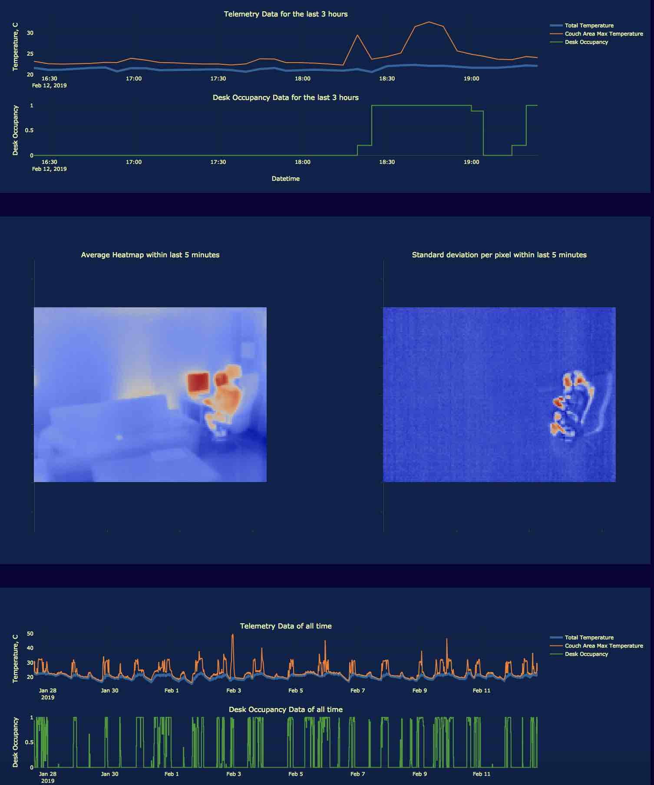

# Thermal Heat App

Python Dash App for monitoring real-time data from the thermal imaging sensor like FLIR Lepton 3.0. The app connects to AWS PostgreSQL database and reads the latest data which is being pushed from thermal camera to the database. 

## Getting Started

Run the app as

```
$ python thermal_heat_app.py
```
Include credentials of your database in the postgresql_credentials.json.

### Prerequisites

```
Python Dash
Plotly
Pandas
psycopg2
```

## Built With

* [Python Dash](https://plot.ly/products/dash/) - The web framework used
* [Pandas](https://pandas.pydata.org/) - Data Analytics

## Snapshot


